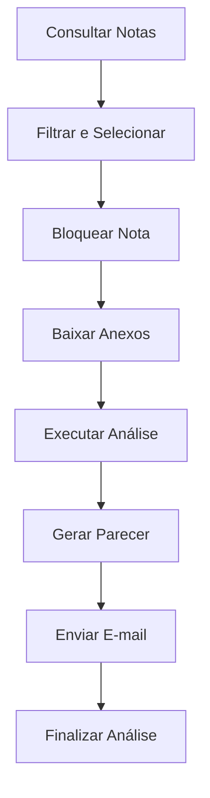

# Análise de Notas Técnicas GD - Versão 2.0.0

## Descrição

Aplicativo Python para automatização do processo de análise de notas técnicas de geração distribuída (GD) na CPFL Energia. Esta versão reestruturada oferece melhor performance, interface moderna, sistema avançado de auditoria e medição de desempenho.

**Desenvolvido por:** Bruno Gobbi - CPFL Energia

## 🚀 Funcionalidades Principais

### ✅ Funcionalidades Existentes Mantidas
- **Consultas automatizadas** ao Oracle e SAP HANA
- **Árvore de decisão completa** com todas as perguntas técnicas
- **Sistema de flags** para identificação de pendências
- **Geração automática de pareceres** (deferimento/indeferimento)
- **Download automático de anexos** do site da CPFL
- **Envio de e-mails** via Power Automate
- **Sistema de bloqueio de notas** para controle de acesso

### 🆕 Novas Funcionalidades
- **Interface moderna** com PyQt5 e design aprimorado
- **Sistema avançado de performance** com medição detalhada
- **Auditoria completa** de todas as ações do usuário
- **Logs estruturados** em formato JSON
- **Tratamento robusto de erros** com recuperação automática
- **Exportação de métricas** em formato Parquet
- **Arquitetura modular** para melhor manutenibilidade

## 📊 Melhorias de Performance

- **Medição detalhada** de tempo gasto em cada etapa
- **Monitoramento de memória** e CPU em tempo real
- **Análise de gargalos** automatizada
- **Exportação de dados** para análise posterior
- **Cache inteligente** para otimização de consultas

## 🔍 Sistema de Auditoria

- **Log de todas as ações** do usuário
- **Rastreamento de decisões** na árvore de perguntas
- **Histórico completo** por nota técnica
- **Relatórios de produtividade** por usuário
- **Análise de padrões** de uso

## 🏗️ Arquitetura

```
src/
├── config/           # Configurações da aplicação
├── core/            # Lógica de negócio principal
├── database/        # Conectores de banco de dados
├── automation/      # Automação web e downloads
├── ui/             # Interface do usuário
└── utils/          # Utilitários e ferramentas
```

## 🔧 Instalação

### Pré-requisitos
- Python 3.8 ou superior
- Oracle Instant Client 23.7
- Acesso à rede da CPFL
- Credenciais para Oracle e SAP HANA

### Instalação das Dependências

```bash
# Clone o repositório
git clone [URL_DO_REPOSITORIO]
cd analise-gd-v2

# Instale as dependências
pip install -r requirements.txt
```

### Configuração

1. **Configure as credenciais** no arquivo `config.json` (será criado automaticamente)
2. **Verifique os caminhos** de rede no arquivo de configurações
3. **Teste a conectividade** com Oracle e SAP HANA

## 🚀 Como Usar

### Execução Básica

```bash
python main.py
```

### Interface do Usuário

1. **Consulta de Notas**: Busque notas técnicas no Oracle com filtros avançados
2. **Seleção de Nota**: Escolha a nota para análise e bloqueie para seu usuário
3. **Download de Anexos**: Baixe automaticamente os documentos do site
4. **Análise Técnica**: Execute a árvore de perguntas completa
5. **Geração de Parecer**: Crie o parecer automaticamente baseado nas flags
6. **Envio de E-mail**: Envie o parecer via Power Automate (opcional)

### Fluxo de Trabalho Otimizado



## 📈 Medição de Performance

### Métricas Coletadas

- **Tempo de consulta** ao banco de dados
- **Duração de cada pergunta** na árvore de decisão
- **Tempo de download** de anexos
- **Performance de geração** de pareceres
- **Uso de memória** e CPU

### Exportação de Dados

Os dados de performance são exportados automaticamente em formato Parquet para análise posterior:

```python
# Localização dos arquivos
\\pfl-cps-file\Divisao_GD\Data\data\performance\
```

### Análise de Produtividade

- **Tempo médio por análise** por usuário
- **Identificação de gargalos** no processo
- **Comparação de performance** entre usuários
- **Tendências de melhoria** ao longo do tempo

## 🔐 Sistema de Auditoria

### Logs Estruturados

Todos os logs são salvos em formato JSON estruturado:

```json
{
  "timestamp": 1703123456.789,
  "user_id": "usuario123",
  "action": "question_answered",
  "note_id": "12345",
  "details": {
    "question_id": "tipo_documento",
    "answer": "pf",
    "flags_activated": ["flag_cpf"]
  }
}
```

### Relatórios de Auditoria

- **Histórico completo** por nota técnica
- **Ações por usuário** em período específico
- **Análise de padrões** de decisão
- **Tempo gasto** em cada etapa

## 🛠️ Configurações Avançadas

### Personalização da Interface

```python
# src/config/settings.py
class UISettings:
    PRIMARY_COLOR = "#2E86AB"      # Cor principal
    ANIMATION_DURATION = 300        # Duração das animações
    ENABLE_ANIMATIONS = True        # Habilitar animações
```

### Configuração de Performance

```python
class PerformanceSettings:
    ENABLE_PERFORMANCE_TRACKING = True
    MAX_PERFORMANCE_RECORDS = 10000
    CACHE_TTL_SECONDS = 3600
```

### Configuração de Logs

```python
class LogSettings:
    LOG_LEVEL = "INFO"
    ENABLE_AUDIT_LOGGING = True
    MAX_LOG_FILE_SIZE_MB = 100
```

## 🔧 Manutenção e Troubleshooting

### Logs de Erro

Os logs de erro são salvos em:
```
\\pfl-cps-file\Divisao_GD\Data\data\logs\errors.log
```

### Limpeza de Cache

Para limpar o cache da aplicação:
```bash
python -c "from src.utils.cache import clear_cache; clear_cache()"
```

### Verificação de Conectividade

```bash
python -c "from src.database.test_connections import test_all; test_all()"
```

## 📋 Changelog

### Versão 2.0.0 (Atual)
- ✅ Interface completamente reestruturada
- ✅ Sistema avançado de performance
- ✅ Auditoria completa implementada
- ✅ Arquitetura modular
- ✅ Tratamento robusto de erros
- ✅ Logs estruturados
- ✅ Exportação de métricas

### Versão 1.0.0 (Original)
- ✅ Funcionalidades básicas
- ✅ Árvore de decisão
- ✅ Conexões com bancos
- ✅ Interface PyQt5 simples

## 🤝 Contribuição

Para contribuir com o projeto:

1. **Reporte bugs** através dos logs estruturados
2. **Sugira melhorias** baseadas nas métricas de performance
3. **Documente alterações** no código
4. **Teste thoroughly** antes de deploy

## 📞 Suporte

**Desenvolvedor:** Bruno Gobbi  
**E-mail:** bgobbi@cpfl.com.br  
**Departamento:** Divisão GD - CPFL Energia

### Resolução de Problemas Comuns

| Problema | Solução |
|----------|---------|
| Erro de conexão Oracle | Verificar credenciais e rede |
| Interface não carrega | Verificar instalação do PyQt5 |
| Performance lenta | Analisar métricas exportadas |
| Erro de permissão | Verificar acesso às pastas de rede |

## 📄 Licença

Uso interno CPFL Energia. Todos os direitos reservados.

---

**Análise GD v2.0.0** - Automatizando o futuro da análise técnica com inteligência e eficiência.